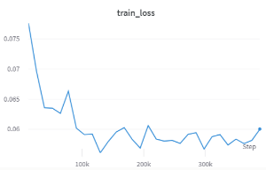
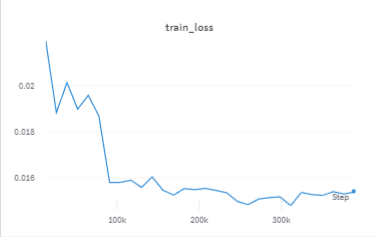
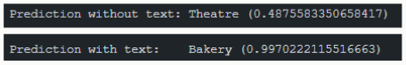
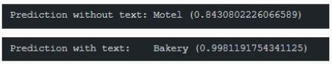

[](https://classroom.github.com/online_ide?assignment_repo_id=11122316&assignment_repo_type=AssignmentRepo)

# XNAP-Project Business Classification

This project aims to classify businesses in street view images using a combination of visual and textual features. The model will be based on the Transformer architecture, which will leverage convolutional neural networks (CNN) and word embeddings to extract information from the images and textual data, respectively.

The objective is to perform fine-grained classification, which involves identifying the specific type of business in the image among 28 different categories. The dataset used for this project consists of 25,255 images from ImageNet and can be found at [https://staff.fnwi.uva.nl/s.karaoglu/datasetWeb/Dataset.html](https://staff.fnwi.uva.nl/s.karaoglu/datasetWeb/Dataset.html). The starting point for the project is the ConTextTransformer repository on GitHub, which will be customized to suit the specific requirements of this project.

## Objectives

Classify businesses on street view images, combining textual and visual features - Fine-grained Classification

## Reference Github Repository

https://github.com/lluisgomez/ConTextTransformer

## Type of Model

Transformer (CNN and Word Embeddings)

## Data

We use the Con-Text dataset which is built from sub-categories of the ImageNet "building" and "place of business" sets to evaluate fine-grained classification. The dataset consists of 28 categories with 24,255 images in total. Note that this dataset is not specifically build for text recognition and thus not all the images have text in them. Moreover, high variability of text size, location, resolution and style and, uncontrolled environmental settings ( illumination ) make text recognition from this dataset harder.

To provide the model with text information, we utilize OCR labels that contain the words of the text and their corresponding locations in the image.

Source of the dataset: https://staff.fnwi.uva.nl/s.karaoglu/datasetWeb/Dataset.html

## Starting point model and architecture


The starting point model and architecture consist in using two model:

First, the input image is passed through a pre-trained convolutional neural network (CNN) model such as ResNet-50.
The last two layers of the CNN model are removed to obtain the intermediate features.
Then the intermediate image features are flattened and passed through a linear layer to reduce the dimensionality to the specified dim. An embedding matrix is created to capture positional information of the image features.
The positional embedding is added element-wise to the image features.

On the other hand, the input text is passed through a linear layer. The linear layer reduces the dimensionality of the input text features.
This linear layer allows the model to capture contextual information and represent the text features in a lower-dimensional space that is consistent with the other input modalities

The image features and text features are concatenated along the sequence dimension. The concatenated features are passed through a stack of transformer encoder layers. Each encoder layer applies self-attention and feed-forward neural networks to capture contextual information.

Finally, the output of the transformer encoder, corresponding to the CLS token, is passed through an MLP head.
The MLP head consists of linear layers with GELU activation and dropout regularization. The final linear layer maps the features to the number of output classes.

## Code structure

The codebase for this project is structured as follows:

├── data/  
├── results/  
├── src/  
│   ├── data/  
│   │   ├── data_loader.py  
│   │   └── conTextDataset.py  
│   ├── models/  
│   │   ├── conTextTransformer.py  
│   ├── utils/  
│   │   ├── utils.py  
│   │   ├── utils_visualization.py  
│   │   └── train_test_labels_split.py  
│   ├── config.py  
│   ├── hyperparameter_tuning.py  
│   ├── inference.py  
│   ├── main.py  
│   ├── train.py  
│   └── test.py  
├── environment.yml  
├── README.md  
└── LICENSE  

The `data` directory will contain all the data files. The `results` directory will contain all the results of the training and testing. Apart from wandb they are also saved in local. The `src` directory will contain all the code files. The `data_loader.py` file will contain the code which created the loaders to to load the data. The `conTextDataset.py` file will contain the code to load the data with its transformations. The `conTextTransformer.py` file will contain the code to create the model and all its layers. The `utils.py` file will contain `make` function which will start all the loaders, datasets objects, schedulers, etc. and also contains an auxiliar function for inference testing. The `utils_visualization.py` file will contain the code to create the plots of the training and testing. The `train_test_labels_split.py` file will contain the code to separate all the train and test data from the initial ORC labels and images that the dataset contains. The `config.py` file will contain the code with all variables used to have all them in same place. The `hyperparameter_tuning.py` file will contain the code to tune the hyperparameters of the model. The `inference.py` file will contain the code to test the model with a single image. The `main.py` file will contain the code to start the pipeline. The `train.py` file will contain the code to train the model. The `test.py` file will contain the code to test the model. The `environment.yml` file will contain the code with the environment configuration. The `README.md` file will contain the code with the information of the project and finally the `LICENSE` file will contain the code with the license of the project.

If we check the `main` code, we can see that is there where we start our main pipeline that is divided into four main steps:

- Config file and Wandb initialization: where we load the config file and initialize wandb. The config file is where we can change all the variables of the pipeline and modify the hyperparameters of the model. Also we can change the type which pretrained model, schedulers, etc. we want to use. The wandb initialization is where we initialize the wandb project and create a new run.
- Data processing and model creation: where we load the data and preprocess it. First we load the data with the dataloader.py file which creates a ConTextDataset with the images and the labels. It returns a train_loader, val_loader and test_loader. All data with its transformations are loaded with the conTextDataset.py file. Then we create the model with the conTextTransformer.py file which creates the model with the resnet50 and the fasttext embeddings.
- Training: where we train the model with the train.py file. It trains the model with the train_loader and then avaluates it with the val_loader. Also if the loss is lower than the best loss, it saves the best parameters of the model. Finally it saves the results of the training in wandb and update the learning rate with the scheduler. Once the training is finished, it created a plot with the results of the training.
- Testing: where we test the model with the test.py file. It loads the best parameters of the model and test it with the test_loader. Then it saves the results of the testing in wandb and creates a plot with the results of the testing.
- Inference: it is basically a test with a single image. It loads the best parameters of the model and test it with the image we choose. It returns the label of the image and the probability of the label. (`NOT ACCURACY`)

## Firsts executions

During the initial executions of the code, the model was trained on the MNIST dataset using a simple CNN architecture. The purpose of these executions was to set up the environment, verify the code's functionality, and ensure that the dependencies were properly installed.

## Changes done to the initial code

The initial code had some errors both in its approach and structure.

* Instead of using a Jupyter Notebook, the code has been restructured into independent modules to improve organization and facilitate maintenance.
* One of the significant changes was the introduction of a validation set to evaluate the model's performance during training. Initially, 80% of the data was allocated to the `trainloader` and 20% to the `testloader`, and the train dataloader was used for both training and evaluating the model. Now, we have created a `validationloader` consisting of 20% of the `trainloader` to have a 60-20-20 split. Instead of using the train loader to evaluate the model, we can use the separate validation set to calculate the loss during model training.
* Another noticeable change is that initially, the model's state was saved at the last epoch of training, and the goal was to maximize the accuracy of this state. In our case, we have made changes to keep the model's state at the epoch with the lowest loss. This change helps to avoid overfitting, saves resources, and improves the model's generalization. Additionally, we have mentioned that we are now focused on minimizing the loss rather than maximizing the accuracy. This is because the loss is a more sensitive measure to individual prediction errors of the model and is generally more interpretable compared to accuracy.
* Furthermore, we have modified the loss function. Initially, the combination of the `log_softmax` and `nll_loss` functions was used, but it has been replaced with the `CrossEntropyLoss` function. The reason for this change is to simplify the code and use a commonly used loss function in the field.

## Improvements

### Different pretrained CNN models used

- ResNet50 (Residual Network) is a variant of the ResNet architecture consisting of 50 layers. It has gained significant popularity in image classification tasks due to its remarkable performance. ResNet50 is a well-suited architecture for solving image classification problems for several reasons. Firstly, its deep structure allows it to capture intricate patterns and features present in images, enabling it to learn complex representations. This is especially beneficial when dealing with datasets that contain diverse and highly detailed visual information. Additionally, ResNet50's residual blocks facilitate the flow of information across connection hops, mitigating the problem of performance decay that often arises with deeper networks. By incorporating skip connections, ResNet50 can effectively address the vanishing gradient problem and accelerate the convergence of the network during training. These factors contribute to its ability to achieve state-of-the-art accuracy in image classification tasks.
- SE_ResNeXt101 (Residual Network with Next) is an advanced variant of the ResNet architecture that demonstrates superior performance compared to ResNet50. Its increased depth, with 101 layers, allows it to capture more intricate patterns and representations, making it well-suited for complex image classification problems. SE_ResNeXt101 incorporates the concept of "cardinal grouping," which enhances the expressiveness of the residual blocks. By using multiple transformation paths within each block, it can capture diverse forms of information and increase the representation power of the network. Furthermore, SE_ResNeXt101 integrates Squeeze-and-Excitation (SE) modules, which adaptively recalibrate the importance of different channels based on their relevance. This attention mechanism enables the network to focus on the most informative features, leading to improved discriminative ability. However, it is important to note that the increased depth and complexity of SE_ResNeXt101 come at the cost of higher computational requirements. Therefore, it may be more suitable for scenarios where computational resources are abundant.
- ShuffleNet is an alternative convolutional neural network architecture designed to strike a balance between efficiency and accuracy. It offers computational advantages by employing group convolutions and channel shuffling operations. This architecture significantly reduces the number of parameters and computational complexity compared to standard convolutions. Consequently, ShuffleNet is more computationally efficient, making it particularly appealing for resource-constrained environments. However, it is crucial to consider that this efficiency gain comes with a trade-off in terms of representation power. ShuffleNet's reduced computational cost limits its capacity to capture intricate details and complex patterns compared to deeper architectures like ResNet50 or SE_ResNeXt101. While it can still achieve reasonably good accuracy, it may not perform as well as the aforementioned architectures in tasks that require fine-grained discrimination or handling highly complex datasets.

### Different Word-Embedding pretrained models used

- FastText is a model developed by Facebook AI Research that is based on vector representations of words (word embeddings). Unlike other embedding models, such as Word2Vec, FastText represents each word as a sum of its subword embeddings. This allows capturing morphological information and the relationship between compound words and their components. In addition, FastText includes a linear classification layer that allows you to perform text classification tasks. Their characteristics are: Model subwords and morphological relationships. It is efficient in terms of memory and training speed. Suitable for the classification of short texts and languages with limited resources. It does not capture the order of words in a sentence. For our problem, where the images contain short words, FastText might be the best choice. Given that FastText models subwords and morphological relationships, it can capture the necessary information to accurately classify the words in the images. Although FastText does not capture the word order within a sentence, this may not be relevant in our case, where classification is based on the presence or absence of key words in the images.
- BERT (Bidirectional Encoder Representations from Transformers) is a model developed by Google that is based on the Transformer architecture, which allows capturing long-range relationships in a text. Unlike traditional NLP approaches that process text sequentially, BERT uses a pretrained language model that learns bidirectional representations of words. This means that BERT considers the context both to the left and to the right of a word in a sentence. Their characteristics are: Models the bidirectional context of words in a sentence. Captures long-range relationships and syntactic dependencies. It is capable of performing natural language processing tasks without the need for additional fine-tuning. It requires more computational resources and training time than FastText. In our problem context, BERT may not be the optimal choice because it is designed primarily for natural language processing tasks, whereas our problem involves analyzing images with isolated or short phrases consisting of one or two words. However, out of curiosity, we still plan to experiment with BERT to explore its performance and potencial insights it may provide.

### Different ways to calculate the loss

- Log Softmax + Negative Log Likelihood Loss: Is the default way to calculate the loss provided in our base project. The activation function F.log_softmax is applied to obtain the model outputs in the form of log-probabilities. Then, the F.nll_loss function (Negative Log Likelihood Loss) is used to calculate the loss based on these log-probabilities and the true target class.
- Cross-Entropy Loss: The CrossEntropyLoss function is directly used, which internally combines the Softmax activation function and the cross-entropy loss function into a single operation. This function calculates both the Softmax activation and the cross-entropy loss, eliminating the need to apply F.log_softmax separately.

  The hypothesis behind the change of way to calculate the loss is as follows:
- Firstly, Cross-Entropy Loss provides greater efficiency by eliminating the need to explicitly apply the F.log_softmax function. This saves computational time and resources since CrossEntropyLoss internally combines the Softmax activation and loss calculation into a single operation.
- Additionally, CrossEntropyLoss enhances numerical stability compared to the previous sequence of F.log_softmax and F.nll_loss. It handles potential issues of overflow or underflow more effectively, ensuring more reliable and accurate loss calculations.
- Furthermore, using CrossEntropyLoss improves code clarity and simplicity. It allows for a cleaner implementation by directly utilizing a specific loss function designed for multi-class classification tasks. This approach conveys the intention of the loss calculation more clearly, making the code easier to read and understand.

### Different Optimizers used

* Adam: The Adam optimizer is a widely used optimization algorithm in deep learning. It combines the advantages of two other popular optimizers, AdaGrad and RMSProp, by incorporating adaptive learning rates and momentum. Adam calculates the adaptive learning rates for each parameter based on their past gradients and uses momentum to accelerate convergence. This optimizer is known for its efficiency, fast convergence, and robust performance across a wide range of tasks and architectures.
  In our initial implementation, we used the Adam optimizer as it is a reliable choice for image classification. It provides a good balance between speed and performance, making it a suitable optimizer for our problem.
* AdamW: AdamW is a variant of the Adam optimizer that incorporates weight decay regularization, also known as L2 regularization. Weight decay helps prevent overfitting by adding a penalty term to the loss function that encourages the model to have smaller weights. The original Adam optimizer did not include weight decay directly in its update rule, but AdamW modifies the algorithm to include this regularization term. By doing so, AdamW can handle weight decay more effectively and potentially improve the generalization performance of the model.

  The hypotesis behind the change in optimizer is as follows:
* We do not expect it to significantly outperform Adam in our image classification task. This is because weight decay regularization is more commonly beneficial in scenarios where the model has a large number of parameters, such as big natural language processing tasks or complex architectures.
* In image classification, the impact of weight decay may be less pronounced, as the model's parameters are primarily influenced by the image features rather than the textual components. Nonetheless, we are curious to evaluate the performance of AdamW and see if it offers any advantages in our specific setting.

### Different Learning Rate Schedulers used

- MultiStepLR: The MultiStepLR scheduler is the default scheduler provided in our base project. It is a learning rate adjustment strategy that reduces the learning rate at specific moments during training. It requires a list of milestones (epochs) and reduces the learning rate by a factor of gamma at each of these milestones.
  In our case, we set a list of milestones [15, 30] and a gamma factor of 0.1. This means that the learning rate was reduced by a factor of 0.1 at epochs 15 and 30.
- ReduceLROnPlateau: The ReduceLROnPlateau scheduler is a learning rate adjustment strategy that reduces the learning rate when a model's improvement reaches a plateau. It monitors a metric, such as validation loss, and if no improvement is observed after a certain number of epochs, it reduces the learning rate by a predetermined factor. The ReduceLROnPlateau scheduler takes into account the evolution of the metric of interest and dynamically adjusts the learning rate based on that information. Therefore, if the model has reached a plateau and is not improving, the scheduler will reduce the learning rate to allow for more precise adjustments and potentially escape of local min.
  In our case, the ReduceLROnPlateau scheduler will dynamically adjust the learning rate based on the loss performance. We have set a threshold of 0.1 to indicate that the loss needs to improve by at least 1% to be considered an improvement. If no improvement is observed in the loss for 5 consecutive epochs (patience), the learning rate will be reduced by a factor of 0.1.

  The hypothesis behind the change in scheduler is as follows:
- The MultiStepLR scheduler is a simple but effective strategy to reduce the learning rate at predefined moments during training. However, it has a significant drawback: it does not consider whether the model has reached a plateau or is not improving. This means that the reduction in the learning rate occurs fixedly, regardless of the actual training situation.
- On the other hand, the ReduceLROnPlateau scheduler offers greater flexibility and adaptability. It closely monitors the metric of interest and reduces the learning rate when a stagnation in the model's performance is detected. This allows for more precise and timely adjustments to the learning rate, which can help avoid local minima and achieve more efficient convergence.

### Hyperparameter tuning with Optuna

We have implemented a `hyperparameter_tuning.py` module using Optuna to find the best batch size and learning rate for our model and problem. Optuna is a powerful framework for hyperparameter optimization that intelligently explores the hyperparameter space to identify optimal configurations. By leveraging Optuna, we aim to maximize our model's performance by fine-tuning these key hyperparameters.

It is important to note that the tests conducted to find the best hyperparameters were of a pilot nature and do not have sufficient strength to determine the optimal hyperparameter combination. This is because we significantly reduced the search space, the number of trials, and the number of epochs per trial to avoid waiting for more than 20 hours to perform a "decent" hyperparameter tuning.

## Tests done and Observations (Abel)

*Before we begin explaining and analyzing the different experiments conducted, it is important to note that we have only logged the loss and accuracy metrics from the evaluation of the train (using the validationloader) and the test sets. Therefore, in those graphs where you see train_*, it refers to the evaluation during training. We acknowledge that it is important to also track the metrics for the train set, but we overlooked this when logging the experiments in wandb. In summary, we only have tracking of the metrics for the validation and test sets.

### Test 1: After making the changes to the initial code

In the first test, we can observe the improvement in accuracy and loss after making the [changes to the initial code](#Changes-done-to-the-initial-code).

 

 

- We use 20 epochs to train this model.

As we can see, we have achieved an improvement of 2.58% in test accuracy. We believe that this improvement is due to the fact that we now use a `validationloader` to evaluate the model during training, reducing the final overfitting of the model.

The model training took 2h 51m 38s.

PD: The significant difference between the test loss and the validation loss at this point is due to the fact that we were still using the initial loss function for training and the new loss function for testing.

### Test 2: Performance of different pretrained CNN models used

 We use 20 epochs to train both models.

#### -- ShuffleNet --


- Accuracy TEST - 0.7299
- Loss TEST - 0.0640

As we can see, the loss have deteriorate 31% with respect to ResNet50. This is probably due to the fact that shuffle net it is not as profound as ResNet50 and dose not have the same learning capacity.

The model training took 1h 50m 42s(-25.9% less with respect to ResNet50.).

We see that shufflenet gives us worse result than ResNet50, but it is faster to train.

#### -- ES_ResneXt101 --


- Accuracy TEST - 0.7925  
- Loss TEST - 0.0494

As we can see, the loss have improved 1.32% with respect to ResNet50.

The model training took 4h 20m 20s (+51.17% more with respect to ResNet50.). The model took more time to train due to the fact that the model is more complex.

We belive that this model with more epochs would probably exceed the ResNet50, but that means to spend more time and more computational power trainning.

### Test 3: Performance of different optimizers used

In this third test, we will observe the difference (improvement/deterioration) in our accuracy and loss when using [different optimizers](#Different-Optimizers-used). In addition, we will examine the performance of the AdamW optimizer.

Adam:

 

AdamW:

 

As we can see, the both accuracy and loss are very similar for both optimizers. That was a bit unexpected, since AdamW is supposed to be an improved version of Adam.

### Test 4: Performance of different schedulers used

In this fourth test, we will observe the difference (improvement/deterioration) in our accuracy and loss when using [different schedulers](#Different-Learning-Rate-Schedulers-used). In addition, we will examine the performance of the ReduceLROnPlateau scheduler.

MultiStepLR:

 

ReduceLROnPlateau:

 

As we can see, the ReduceLROnPlateau scheduler has a more "aggressive" learning rate reduction strategy than the MultiStepLR scheduler. This is because the former scheduler is more sensitive to stagnation in the model's performance, which is why it reduces the learning rate more frequently.

The results obtained with the ReduceLROnPlateau scheduler are almost identical. Finally we decided to use the ReduceLROnPlateau scheduler because it is more sensitive to stagnation in the model's performance, which is why it reduces the learning rate more frequently.

### Extra Test: Hyperparameter Tuning with Optuna

In the final test, we will execute [the hyperparameter tuning with Optuna](#Hyperparameter-tuning-with-Optuna)  implemented by us.

The hyperparameter tuning was conducted with the following configurations:

* Number of trials: 4
* Epochs per trial: 5
* Search space:
  * Learning rate: [1e-5, 1e-4, 1e-3]
    * The values used revolve around the initial learning rate (1e-4).
  * Batch Size: [16, 32, 64]
    * The values used revolve around the initial batch size (32).
* Sampler: TPE (Tree-structured Parzen Estimator)
  * Which optimizes the search space to avoid testing all possible combinations (it progressively approximates the optimal solution).

Below you can see some graphs comparing the results of the different trials.


As we can see, with 5 epochs, the best combination found is a batch size of 64 and a learning rate of 0.0001, followed by a batch size of 16 and a learning rate of 0.00001 (which we were using previously).

However, it's important to note that due to the limited number of epochs in this experiment (for computational cost reasons), we cannot confirm that this hyperparameter combination is the best. To accurately determine the optimal hyperparameters, it is recommended to perform hyperparameter tuning with a minimum of 15-20 epochs and more than 10 trials. This would allow for a more comprehensive exploration of the hyperparameter space and provide more reliable and justified choices for the hyperparameters.

As I mentioned before, since 5 epochs is not significant enough to determine whether a batch size of 64 and a learning rate of 0.0001 are the best hyperparameters, we have trained the model with these settings for 30 epochs.




As we can see, the results are not bad, but they are slightly worse than using a batch size of 16 and a learning rate of 0.0001. The reason why these hyperparameters were better with 5 epochs is that with a larger batch size and learning rate, the model is able to learn faster in the initial epochs, but afterwards it can lead to oscillations in the model weights and make it difficult to converge to an optimal solution.

Based on the initial executions and the improvements we already implemented, some potential areas for improvement are identified:

- Explore different CNN pretrained models such as InceptionV3 to compare their performance.
- Experiment with different word-embedding pretrained models such as ELMO (Embeddings from Language Models) or GPT (Generative Pre-trained Transformer) to capture more contextual information. These models have shown promising results in various NLP tasks by leveraging the power of transformer-based architectures.
- Fine-tune the hyperparameters of the model to optimize its performance on the specific business classification task. This can include adjusting the learning rate, batch size, optimizer, and regularization techniques (e.g., dropout) to find the best configuration for the given dataset.
- Experiment with different loss functions tailored to the fine-grained classification task. For example, focal loss or class-balanced loss can be explored to handle class imbalance and focus more on challenging samples during training.
- Conduct extensive model evaluation and analysis, including performance metrics, confusion matrix, and visualization of model predictions, to gain insights into the model's strengths and weaknesses. This analysis can guide further improvements and help understand the limitations of the current approach.

## Weight & Bias

The Weights & Biases package is integrated into the code to monitor the network's learning progress. It provides visualizations and metrics to track the model's performance during training. By utilizing Weights & Biases, it becomes easier to analyze and interpret the training process, identify potential issues, and make informed decisions for model improvement.

The following metrics are the once we decided to monitor during training:

- Epochs: The number of epochs completed during training.
- Classes: The number of classes in the dataset.
- Batch Size: The number of samples per batch.
- Learning Rate: The last learning rate used during training.
- Scheduler: The optimizer's learning rate scheduler type.
- Optimizer: The optimizer type.
- Dataset: The dataset used for training.
- Architecture: The model architecture. Default: "Context Transformer".
- Pretrained Model: The pretrained model used for transfer learning. Default: "ResNet50".
- Text Model: The pretrained model used for word embedding. Default: "fasttext".
- Device: The device used for training. Default: "cuda".

Global WANDB page:


WANDB saved variables page:


## Inferences

It is also been implemented a script to make inferences with the trained model. The script is called inference.py.
The main function consists of predicting the bussiness class of a given image. First we load the pretrained model and the image to predict. Then we introduce the image into the model with its OCR labels (text that can be found in the image) and we get the label which has the highest probability as a result.

We make two tests for each image, one with the OCR labels and another without them. The results are the following:

### Test 1:




### Test 2:


### Test 3:


### Test 4:




### Test 5:


## General Conclusions

In this project, we aimed to classify businesses in street view images using a combination of visual and textual features. We used a Transformer-based model that leveraged convolutional neural networks (CNN) for image feature extraction and word embeddings for text feature extraction.

The project focused on fine-grained classification, where we aimed to identify the specific type of business among 28 different categories. We utilized the Con-Text dataset, which consisted of 25,255 images from ImageNet and included OCR labels for text information.

We started with the ConTextTransformer repository as our base code and made several improvements and modifications. We restructured the code into independent modules, introduced a validation set for evaluating the model's performance, and changed the model's state saving to the epoch with the lowest loss. We also modified the loss function to use CrossEntropyLoss for simplicity and numerical stability.

Furthermore, we explored different pretrained CNN models (ResNet50, SE_ResNeXt101, ShuffleNet) and word-embedding models (FastText, BERT) to enhance the model's performance and capture intricate visual and textual information.

We also experimented with different optimizers (Adam, AdamW) and learning rate schedulers (MultiStepLR, ReduceLROnPlateau) to improve training efficiency and convergence.

Overall, this project aimed to develop a robust and accurate model for classifying businesses in street view images. The combination of visual and textual features allowed us to capture relevant information and achieve fine-grained classification. The improvements made to the initial code, along with the exploration of different models, optimizers, and learning rate schedulers, aimed to enhance the model's performance.

By implementing these modifications and improvements, we expect to achieve a highly accurate and reliable business classification model that can be applied to real-world scenarios, such as urban planning, business analysis, and location-based services but it needs further improvements to achieve this goal as the best accuracy achieved was 85%.

## How to Run the code?

Before running the code you have to create a local environment with conda and activate it. The provided [environment.yml](https://github.com/DCC-UAB/XNAP-Project/environment.yml) file has all the required dependencies. Run the following command: ``conda env create --file environment.yml `` to create a conda environment with all the required dependencies and then activate it:

```
conda activate xnap-example
```

To run the example code:

```
python main.py
```

Once created the conda environment and activated it, you must configure the variables in the `config.py` file.

Whenever we have all the variables configured, then run the code with the following command to execute the `main.py` script to run the training, test and inference processes:

```
python ./src/main.py
```

To run the hyperparameter tuning with Optuna:

```
python ./src/hyperparameter_tuning.py
```

## Bibliografia

* Seref Karaoglu. (2021). Business Image Dataset. Retrieved from [https://staff.fnwi.uva.nl/s.karaoglu/datasetWeb/Dataset.html](https://staff.fnwi.uva.nl/s.karaoglu/datasetWeb/Dataset.html)
* Gomez, L., & Karacapilidis, N. (2021). ConTextTransformer: Learning with Visual and Textual Contextual Cues. In Proceedings of the 26th ACM SIGKDD International Conference on Knowledge Discovery & Data Mining (pp. 2829-2838).

## Contributors

- Abel Espin Romero 1605961@uab.cat
- Biel Castellarnau Ruiz 1599417@uab.cat
- Sergi Garriga Mas 1606989@uab.cat

Xarxes Neuronals i Aprenentatge Profund,  
Grau d'Enginyeria de Dades, UAB,   
Curs 2022-2023  


